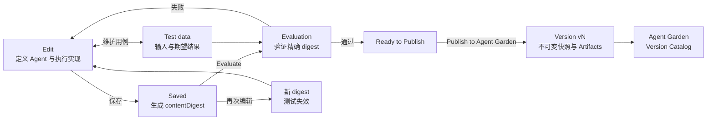
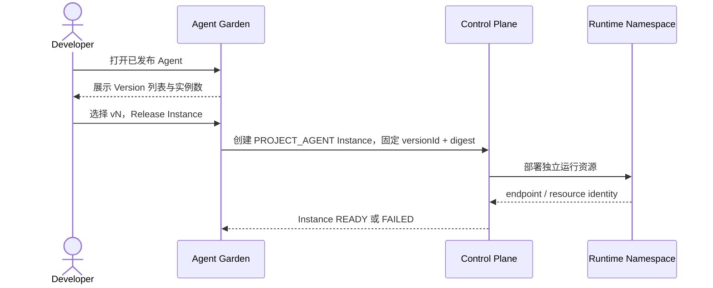
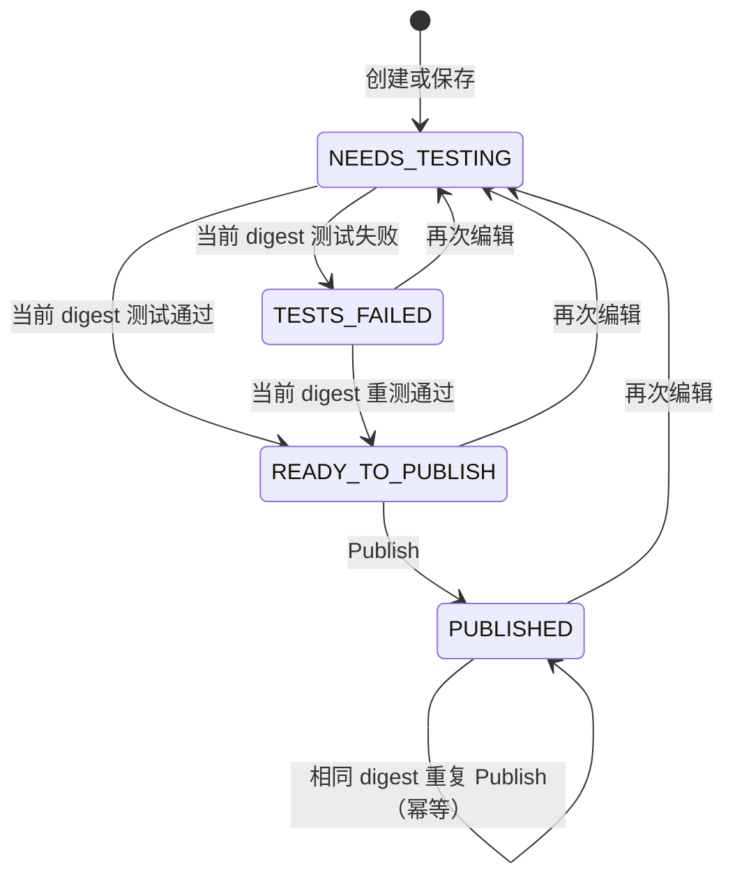
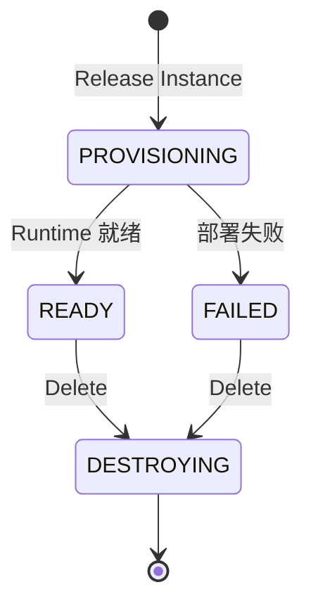
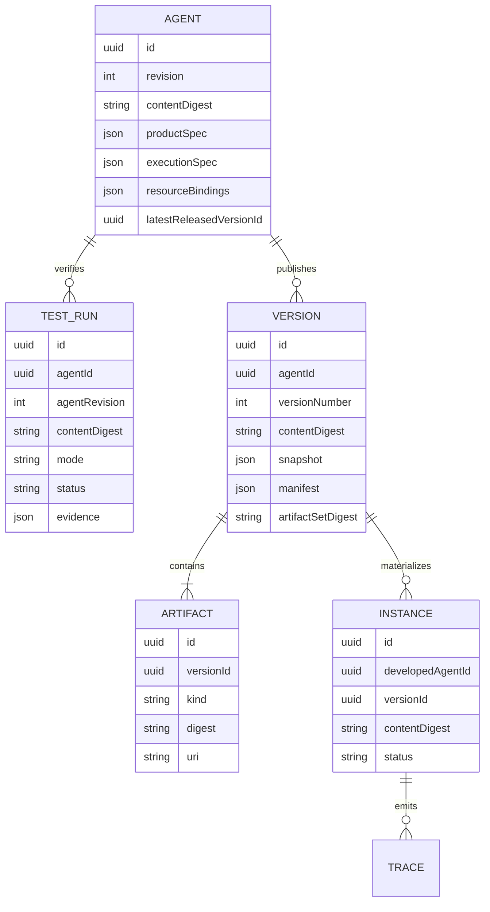

# Agent Developer 技术方案

## 1. 结论

Agent Developer 采用一条可解释的主线：

`Edit ↔ Test data ↔ Evaluate → Publish Version → Agent Garden → Release Instance → Channels & Observability`

- `Agent` 是开发者持续修改的产品定义，执行模型只有 `Adaptive Agent` 与 `Workflow Agent`。
- `Test data` 管理可复用的输入、预期结果和发布必过用例。
- `Evaluate` 验证某一次保存后的精确内容摘要。
- `Publish` 冻结当前 Agent，生成不可变 `Version` 与 `Artifact`，并发布到 `Agent Garden`。
- `Agent Garden` 是可用 Version 的目录和实例化入口，不是运行端点列表。
- `Release Instance` 从用户明确选择的 Version 创建独立运行实体。
- 一个 Version 可以创建多个 Instance；发布新 Version 不自动替换已有 Instance。

Chat、Voice、API、Webhook、Embed 与 A2A 是 Instance 的交付渠道，不是 Agent 类型。渠道只在 Version 被实例化后配置；Observability 观察 Instance 的运行，不进入 Agent 开发工作区。

系统不保留 Working Copy、Candidate 等中间概念。Publish 不创建运行资源；Release 才创建 Instance，也不提供隐式升级。

## 2. 核心交互流程

### 2.1 开发与发布

Agent 详情页保留四个平级、可往返的工作区，不使用编号 Stepper：

- `Edit`：编辑产品定义与执行实现。Workflow Agent 以 LangGraph 画布为主工作区，节点 Inspector 承担局部配置；Adaptive Agent 以 instructions、model routing、tools 与 guardrails 为主。
- `Test data`：编辑用例输入、执行路径、期望结果与 required-for-publish 标记。
- `Evaluate`：运行当前摘要并展示断言证据；评估结果与保存后的精确 digest 绑定。
- `Versions`：只读查看不可变 Version、Artifacts、发布时间与 Agent Garden 可用状态。

`Publish` 不是第三个导航页面，而是测试通过后出现的主命令。点击后打开发布审查 Sheet，确认测试证据、Version Notes 和即将冻结的 Artifacts；成功后展示回执并引导用户进入 Agent Garden。

Agent 标题区根据事实只出现当前最重要的操作：`Save changes`、`Run evaluation`、`Publish` 或 `Open published Version`。`Publish` 仍是页头主命令，不是第五个工作区。

### 2.2 从 Garden 创建 Instance

关键交互约束：

- 必须显式选择 Version；默认选最新发布 Version，但不替用户隐藏选择。
- 创建操作每次生成新的 `instanceId` 和独立运行资源。
- Version 页面只展示历史与交付证据，不出现运行控制。
- Instance 的启动、删除、日志和 Trace 全部在 `Instances` / `Traces` 中处理。
- 发布 v2 后，基于 v1 的 Instance 继续运行；升级通过“基于 v2 新建 Instance”完成。

## 3. 产品状态流转

### 3.1 Agent 交付状态

状态不是单独维护的业务真相，而是由以下事实推导：

- Agent 当前 `contentDigest`；
- 最新 Publish Test 的 `contentDigest` 与结果；
- 最新 Version 的 `contentDigest`。

因此不会出现页面状态和数据库事实互相矛盾。

### 3.2 Instance 运行状态

Instance 始终固定以下身份：

`projectId + instanceId + developedAgentId + versionId + contentDigest`

运行请求、资源访问和 Trace 必须同时匹配这组身份，不能只凭 Agent 名称访问。

## 4. 核心产品概念边界

| 概念 | 可变性 | 所属位置 | 职责 | 明确不负责 |
| --- | --- | --- | --- | --- |
| Agent | 可变 | Agent Developer | 产品定义、执行定义、资源与安全约束 | 不表示某个正在运行的进程 |
| Test Dataset | 可变 | Agent Developer / Test data | 保存可复用输入、期望结果与发布门禁 | 不代表一次实际运行结果 |
| Evaluation Run | 不可变证据 | Agent Developer / Evaluate | 证明某个 digest 是否通过指定评估 | 不修改 Agent，不创建 Version |
| Version | 不可变 | Agent Garden | 一次 Publish 的可分发快照 | 不保存 endpoint，不自动运行 |
| Artifact | 不可变 | Version | 执行配置、资源锁、测试报告、来源证明 | 不拥有生命周期状态 |
| Agent Garden | 目录 + 工厂 | 项目 | 发现已发布 Version，选择 Version 创建 Instance | 不等同于 Instance 列表 |
| Instance | 可变运行状态 | Runtime | 运行一个固定 Version，拥有独立 runtime identity | 不跟随 Agent 或最新 Version 自动变化 |
| Trace | 追加式运行证据 | Runtime | 记录 instanceId、versionId 和 digest 对应的执行 | 不作为 Publish Test 结果替代品 |

`Agent` 与 `Instance` 是最重要的边界：前者是开发对象，后者是运行对象。`Publish` 跨越 Agent 到 Version/Artifact 的边界；`Release` 跨越 Version 到 Runtime Instance 的边界。

## 5. 数据模型

数据库约束：

- `(project_id, agent_id, version_number)` 唯一。
- `(project_id, agent_id, content_digest)` 唯一，使相同内容的 Publish 幂等。
- Version 与 Artifact 禁止更新，只能发布新 Version。
- `PROJECT_AGENT` Instance 必须同时引用 developed Agent 与 Version。
- 数据库验证 Version 必须属于该 Agent。
- 删除 Agent 会级联清理其 Definition、Test、Version 与 Artifact；存在活动 Instance 或被其他 Agent 委派引用时阻止删除。

## 6. 服务与 API

### 6.1 Agent Developer

- `GET /api/v1/projects/{projectId}/agents`
- `POST /api/v1/projects/{projectId}/agents`
- `GET /api/v1/projects/{projectId}/agents/{agentId}`
- `PATCH /api/v1/projects/{projectId}/agents/{agentId}`
- `POST /api/v1/projects/{projectId}/agents/{agentId}/test-runs`
- `POST /api/v1/projects/{projectId}/agents/{agentId}/publications`
- `GET /api/v1/projects/{projectId}/agents/{agentId}/versions`
- `GET /api/v1/projects/{projectId}/agents/{agentId}/resource-revisions`
- `GET /api/v1/projects/{projectId}/agents/{agentId}/available-resources`

`PATCH` 使用 `expectedRevision` 做乐观并发控制。Test Run 必须记录实际执行的摘要；Publish 在事务中重新读取 Agent、锁定 Agent、核对通过的 Test Run 后创建 Version 与 Artifact。

### 6.2 Garden 与 Runtime

- `GET /api/v1/projects/{projectId}/agent-garden`
- `POST /api/v1/projects/{projectId}/agent-garden/agents/{agentId}/instances`
  - body: `{ "versionId": "..." }`
- `GET /api/v1/projects/{projectId}/instances`
- `GET /api/v1/projects/{projectId}/instances/{instanceId}`
- `DELETE /api/v1/projects/{projectId}/instances/{instanceId}`

运行桥接接口使用 `/api/v1/runtime-bridge/agents/{agentId}/versions/{versionId}/...`。访问令牌与 Agent、Version、摘要和 Project Runtime Namespace 绑定；运行资源名称由 `instanceId` 生成，确保同一 Version 可并行实例化。

## 7. 信息架构与视觉状态

Developer 侧边栏：

- 开发：`Agents`、`Agent Garden`
- 运行：`Instances`、`Traces`
- 能力：`Skills`、`MCP Connections`、`Vector Databases`、`Memory`

Agent Developer 工作区固定为 `Edit / Test data / Evaluate / Versions`。API config、Webhooks、Embed code、A2A configuration、third-party apps、team sharing、Chat 与 Voice 均属于 Agent Garden / Instance 的渠道配置；运行日志、指标与调用追踪属于 Instances / Traces。

Logo 返回 Developer Home，不额外占用“项目概览”导航项。

颜色只表达一种语义：

- 黑色：当前页面唯一主操作；
- 蓝色：当前工作区、焦点、正在执行；
- 绿色：Test 通过、Version 已发布、Instance Ready；
- 琥珀色：缺少 Test、存在发布门禁、等待处理；
- 红色：Test 失败、Publish 失败、Instance Failed；
- 中性色：已保存、未测试、历史信息。

不使用大面积浅色状态背景。状态通过小型 badge、左侧强调线和紧邻对象的说明表达。

## 8. 破坏性迁移策略

当前 Agent Developer 尚未对外稳定，因此迁移不维护旧流程：

1. 清空早期 Agent Developer 交付数据和 PROJECT_AGENT 运行记录；
2. 删除旧中间生命周期表与旧 API；
3. 在 Agent 主表增加直接定义、revision 与 contentDigest；
4. 创建 Test Run、Version、Version Artifact 表；
5. 在统一 Instance 表增加 developedAgentId 与 agentVersionId；
6. 前后端同时切换到 `/agents` 路由和新状态机。

Project、成员、能力资源、外部 Agent Garden 条目和非 Agent Developer Instance 不受此次重置影响。

## 9. 交付结果与验收标准

### 代码交付

- 直接可编辑 Agent aggregate 与乐观并发控制；
- digest 精确绑定的 Test Run；
- 不可变 Version、Manifest 与 Artifact；
- Agent Garden Version 目录和 Version 选择器；
- 显式、可重复的 Instance materialization；
- Instance 详情、Runtime Inventory 与 Version 归因；
- 新 API、权限声明、审计分类、OpenAPI 描述；
- `Edit / Test data / Evaluate / Versions` 工作区、发布审查 Sheet 与统一状态色；
- 破坏性数据库迁移和产品不变量测试。

### 验收场景

1. 新建 Agent 后直接进入 Develop，不出现额外编辑对象。
2. 未测试不能 Publish；测试失败不能 Publish。
3. 修改 Agent 后旧测试立即失效。
4. 当前摘要测试通过后可 Publish，产生 v1 和 Artifact，但 Instance 数仍为 0。
5. Agent Garden 展示 v1，且不展示虚假的 runtime endpoint。
6. 从 v1 连续创建两次，得到两个不同 instanceId、两套独立运行资源。
7. 发布 v2 后，两个 v1 Instance 仍固定在 v1。
8. Instance 详情能看到 Agent、Version、摘要、状态和 Trace 入口。
9. Developer 导航能从 Agents 到 Garden，再到 Instances 与 Traces，流程不需要猜测术语。
